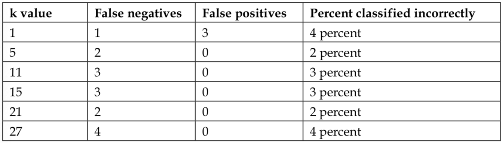

En este documento se realiza un informe dinámico del ejemplo de k-NN para el diagnóstico de cáncer de mama mostrado en el libro Machine Learning With R [@Lantz2015MLR2876101]. Para más información ir a [dataspelunking GitHub](https://github.com/dataspelunking?tab=repositories).

# Aprendizaje Vago - Clasificación Usando Vecinos Más Cercanos (k-NN)

Pese a ser uno de los algoritmos más sencillos en aprendizaje automático (machine learning) el *k-NN*, de sus siglas en inglés **k-nearest neighbors**, es usado extensamente.
Su nombre proviene del hecho de que etiqueta un objeto problema de un tipo dado, utilizando la distancia, normalmente euclídea, de ese objeto a los *k* vecinos más cercanos ya clasificados. La letra *k* es una variable que representa el número de objetos vecinos para los que mediremos las distancias. Tras la elección de *k*, el algoritmo necesita un dataset de entrenamiento en el cuál se incluirán objetos ejemplo ya clasificados. Entonces para cada muestra problema sin identificar, k-NN identificará *k* medidas de las distancias de estos objetos ya clasificados a la muestra problema. La muestra problema será asignada con la misma clase que tengan la mayoría de *k* vecinos más cercanos.

```{r libraries, include=FALSE}
# Install packages
# Load packages
# Set working directory
options(repos="https://cran.rstudio.com" )
library(gmodels)
library(class)
library(knitr)
setwd("~/Desktop/Machine Learning/week3n4_03-10-18")
```
## Pros y Contras del algoritmo k-NN

Podemos recoger las fortalezas y debilidades de este algoritmo en la siguiente tabla:

| Fortalezas                                                        | Debilidades                                                                                                 |
|-------------------------------------------------------------------|-------------------------------------------------------------------------------------------------------------|
|• Simple y efectivo                                                |• No produce un modelo, limitando la capacidad de comprender la relación de las características de cada clase|
|• No hace asunciones en base a la distribución de datos subyacente.|• Requiere selección de un *k* apropriado                                                                    |
|• Fase de entrenamiento rápida                                     |• Fase de clasificación lenta                                                                                |
|                                                                   |• Las características nominales y datos faltantes requiren proceso adicional                                 |
---
## Paso 1 - recolección de datos

Utilizaremos para el análisis el data set "Wisconsin Breast Cancer Diagnostic" procedente de [UCI Machine Learning Repository](https://archive.ics.uci.edu/ml/index.php). Este data set ha sido donado por la Universidad de Winsconsin e incluye medidas de imágenes digitalizadas de muestras celulares de tejido mamario obtenidas por aspiración con aguja fina. Los valores representan características del núcleo celular presentadas en la imagen digital.

Los datos incluyen 569 ejemplos de biopsias de cáncer, cada una con 32 caracteríasticas. Una característica es el número de identificación, otra es el diagnóstico del cáncer codificado como "M" si es maligno y "B" si es benigno. Las otras 30 son 3 medidas de laboratorio, la media, el error estandar y el valor más alto, con valores numéricos de 10 características diferentes :

* Radio
* Textura
* Área
* Rugosidad
* Compactación
* Concavidad
* Puntos cóncavos
* Simetría
* Dimensión fractal

Basándonos en los nombres, todas estas caracteríasticas parecen referirse a la forma y tamaño de los núcleos celulares. A menos que fuésemos oncólogos, no sabríamos como cada una de estas características se relaciona con masas malignas o benignas. Estos patrones serán revelados conforme vayamos continuando en el proceso de aprendizaje automático.

## Paso 2 - exploración y preparación de datos

Vamos a explorar los datos y ver si podemos arrojar luz sobre estas relaciones. Para ello, vamos a preparar los datos que usaremos con el método de aprendizaje k-NN.

> Si tienes pensado seguir el código del ejercicio a la vez paso por paso, descarga el archivo `wisc_bc_data.csv` que podrás encontrar en los archivos que acompañan a este y guárdalo en tu directorio de trabajo de R. El data set está ligeramente modificado del original. En concreto, se le ha añadido una cabecera y las filas de datos han sido ordenadas al azar.
> Si además quieres compilar este documento de Rmarkdown con Knit, descarga también los archivos `biblio.bib` para la bibliografía, y `custom.css` para el estilo personalizado de ciertos elementos, los encontrarás en este mismo repositorio, asegúrate también de guardarlos en tu directorio de trabajo, así como las imágenes `diferentesvaloresk.png` y `tablaknn().png`. 

Primero importamos el archivo CSV, y lo asignamos al data frame `wbcd` :
```{r}
wbcd <- read.csv("wisc_bc_data.csv", stringsAsFactors = FALSE)
```

Usando el comando `str(wbcd)`, podemos confirmar que los datos están estructurados con 569 ejemplos y 32 características como esperábamos. Las primeras líneas de salida son las siguientes:

```{r echo=FALSE}
str(wbcd, list.len =6)
```
 La primera variable es de tipo entero (integer) llamada `id`. Como es simplemente un identificador único (ID) para cada paciente en los datos, no provee información útil, y tendremos que excluirla del modelo.
 
Independientemente del método de aprendizaje automático, las variables ID siempre deberán ser excluidas. De no hacerlo esto podría conducir a conclusiones erróneas ya que el ID puede ser usado para "predecir"" cada ejemplo de manera única. De este modo, un modelo que incluye un identificador sufrirá de sobreajuste, y es improbable que generalice bien para otros datos.

Desechemos la característica `id` totalmente. Como está localizada en la primera columna, podemos excluirla haciendo una copia del data frame `wbcd` pero sin la columna 1:

```{r}
wbcd <- wbcd[-1]
```

La siguiente variable, `diagnosis`, es de interés particular ya que es el resultado que queremos predecir. Esta característica indica si la muestra es de una masa benigna o maligna. La salida de `table()` indica que 357 masas son benignas mientras que 212 son malignas.

```{r}
table(wbcd$diagnosis)
```

Muchos clasificiadores de aprendizaje automático de R requieren que la característica objetivo esté codificada como factor, así que necesitaremos recodificar la variable `diagnosis`. Aprovecharemos para darle unos valores más informativos a las etiquetas usando `labels`:

```{r}
wbcd$diagnosis <- factor(wbcd$diagnosis, levels = c("B","M"), labels = c("Benigno", "Maligno"))
```

Ahora cuando miremos a la salida de `prop.table()`, notamos que los valores han sido etiquetados `Benigno` y `Maligno` con un 62.7 % y 37.3 % de las masas, respectivamente:

```{r}
round(prop.table(table(wbcd$diagnosis)) * 100, digits = 1)
```

Las 30 características restantes son todas numéricas y como se esperaba, consisten en tres medidas diferentes de diez características. Con fin ilustrativo, solo veremos de cerca a tres de esas características.

```{r}
summary(wbcd[c("radius_mean", "area_mean", "smoothness_mean")])
```

Rápidamente podemos notar que tenemos un problema de escala de los datos ya que unos varían entre valores de `0.05` y `0.16`, como es el caso de la rugosidad (`smoothness_mean`), y otros se mueven en rangos que van desde `143.5` a `2501.0` como es el caso del área (`area_mean`), el impacto del área va a ser mucho mayor que el de rugosidad a la hora de calcular la distancia. Esto, potencialmente, podría causar problemas a nuestro clasificador, por lo que aplicaremos un método de normalización para reescalar las características a un rango estándar de valores.

### Transformación - normalización de datos numéricos

Para normalizar estas características, necesitaremos crear una función `normalizar()` en R. Esta función tomará un vector `x` de valores numéricos y por cada valor de este vector, sustrae el valor mínimo del vector y lo divide por el rango de valores del vector. Finalmente, el vector resultante es devuelto. El código para esta función es el siguiente:

```{r}
normalizar <- function (x) {
       return ((x - min(x)) / (max(x) - min(x)))
}
```

Después de ejecutar el código anterior la función `normalizar()` está lista para usarse en R. Vamos a comprobar que funciona con un par de vectores:

```{r}
normalizar(c(1, 2, 3, 4, 5))
normalizar(c(10, 20, 30, 40, 50))
```

La función parece estar funcionando correctamente. A pesar del hecho de que los valores del segundo vector son 10 veces mayor que en el primero, después de la normalización, ambos aparecen exactamente iguales.

Ahora podemos aplicar la función `normalizar()` a las características numéricas en nuestro data frame. En lugar de normalizar cada una de las 30 variables numéricas individualmente, usaremos una de las funciones de R para automatizar el proceso.

La función `lapply()` toma una lista y le aplica una función específica a cada elemento de la lista. Como un data frame es una lista de vectores de la misma longitud, podemos usar `lapply()` para aplicar `normalizar()` a cada característica del data frame. El paso final es convertir la lista devuelta por `lapply()` a data frame, usando la función `as.data.frame()`. El proceso completo tiene este aspecto:

```{r}
wbcd_n <- as.data.frame(lapply(wbcd[2:31], normalizar))
```

básicamente este comando aplica normalizar desde las columnas 2 hasta la 31 en el dataframe `wbcd`, convierte la lista resultante en un data frame, y le asigna el nombre `wbcd_n`. El sufijo `_n` es usado como recordatorio de que sus valores están normalizados.

Para confirmar que la transformación ha sido bien aplicada, echemos un vistazo al resumen estadístico de una de las variables:

```{r}
summary(wbcd_n$area_mean)
```

Como esperábamos, la variable `area_mean`, que originalmente variaba en el rango de 143.5 a 2501.0, ahora varía en el rango de 0 a 1.

### Preparación de datos - creación los datasets de prueba y entrenamiento

Aunque todas las 569 biopsias están etiquetadas como benignas o malignas, no es muy interesante predecir lo que ya sabemos. Además, cualquier medida que obtengamos durante el entenamiento podría ser engañosa al no saber hasta que grado ha habido sobreajuste en casos o qué tan bien generalizará el algoritmo de aprendizaje (aprendiz) a casos no vistos. Una cuestión más interesante es lo bien que nuestro aprendiz actuará sobre un dataset de datos sin etiquetar. Si estuviésemos en el laboratorio, podríamos aplicar nuestro algoritmo a los siguientes medidas tomadas de las próximas 100 muestras de masas celulares de condición cancerígena desconocida, y ver en qué medida las predicciones del aprendiz automático se comparan a los diagnósticos obtenidos usando métodos convencionales.

A la falta de esos datos, podemos simular este escenario dividiendo los datos en dos porciones: un dataset de entrenamiento que será usado para construir el modelo de k-NN y uno de prueba que será usado para estimar la precisión predictiva del modelo. Usaremos los primeros 469 registros para el dataset de entrenamiento y los 100 siguientes para simular nuevos pacientes.

Dividiremos el dataframe `wbcd_n`en `wbcd_entreno` y `wbcd_prueba` de la siguiente forma:

```{r}
wbcd_entreno <- wbcd_n[1:469,]
wbcd_prueba <- wbcd_n[470:569,]
```

Los datos se extraen de los datasets siguiendo la sintaxsis `[fila, columna]`. Un valor en blanco para una fila o una columna indica que todas las filas o columnas deben ser incluídas. Por lo tanto, la primera línea de código toma de las filas 1 a la 469 y todas las columnas, y la segunda línea toma 100 filas desde 470 a la 569 y todas las columnas.

>Al construir datasets de entrenamiento, es importante tener en cuenta que cada dataset sea un subconjunto representativo del conjunto completo de datos. Los registros en `wbcd` estaban previamente ordenados al azar, así hemos podido extraer 100 registros consecutivos para crear el dataset. Esto no sería apropiado si los datos estuviesen ordenados cronológicamente o en grupos de valores similares. En esos casos necesitaríamos utilizar métodos de muestreo aleatorio. 
>

Cuando construimos nuestros datasets de entrenamiento y prueba normalizados, excluimos la variable objetivo, `diagnosis`. Para el entrenamiento del modelo k-NN, necesitamos estas etiquetas de clase en un vector de factores, separados entre el dataset de entrenamiento y el de prueba:

```{r}
wbcd_entrenamiento_etiquetas <- wbcd[1:469, 1]
wbcd_prueba_etiquetas <- wbcd[470:569, 1]
```

El código anterior toma el factor `diagnosis` de la primera columna del dataframe `wbcd` y crea los vectores `wbcd_entrenamiento_etiquetas` y `wbcd_prueba_etiquetas`. Usaremos estos en los próximos pasos de entrenamiento y evaluación de nuestro clasificador.

## Paso 3 - entrenamiento del modelo sobre los datos

Equipados con nuestros vectores de entrenamiento, prueba y etiquetas, ya estamos preparados para clasificar nuestros registros desconocidos. Para el algoritmo k-NN, la fase de entrenamiento en realidad no implica la construcción de un modelo; el proceso de entrenamiento de un aprendiz vago como k-NN simplemente implica almacenar los datos de entrada en un formato estructurado.

Para clasificar nuestros casos de prueba, usaremos una implementación de k-NN desde el paquete `class`, este provee de un conjunto de funciones básicas de R para clasificación. Si este paquete no está instalado ya en tu sistema, lo puedes instalar mediante:

```{r eval=F}
install.packages("class")
```

Para cargar el paquete durante cualquier sesión donde quieras usar las funciones, simplemente introduce el comando `library(class)`.

La función `knn()` en el paquete `class` proporciona una clásica y estándar implementación del algoritmo k-NN. Por cada caso en los datos de la prueba, la función identificará a los *k* vecinos más cercanos, usando distancias euclídeas, donde *k* es un número especificado por el usuario. El caso será clasificado por "votación" entre los *k* vecinos más cercanos específicamente, esto supone la asignación de la clase de la mayoría de los *k* vecinos. Un empate se resolvería al azar.

> Hay muchas otras funciones de k-NN en otros paquetes de R, que proveen de implementaciones más eficientes o más sofisticadas. Si `knn()` se queda corto, busca k-NN en [Comprehensive R Archive Network (CRAN)](https://cran.r-project.org).
>

El entrenamiento y clasisficación por medio de la función `knn()` se ejecuta llamando a la misma función, usando cuatro parámetros, como se muestra en esta tabla:

.png)

Ahora casi tenemos todo lo que necesitamos para aplicar el algoritmo k-NN a estos datos. Hemos dividido nuestros datos en los datasets entenamiento y prueba, cada uno con las mismas características numéricas. Las etiquetas de los datos de entrenamiento están guardadas por separado en un vector de factores. El único parámetro que nos queda es *k*, que especifica el número de vecinos que incluiremos en la votación.

Como nuestros datos de entrenamiento tienen 469 entradas, podríamos intentar `k = 21`, un número impar cercano a la raíz cuadrada de 469. Con un resultado de dos categorías, usar un número impar elimina la probabilidad de acabar con una votación empatada.

Ahora podemos usar la función `knn()` para clasificar los datos de `prueba`:

```{r}
wbcd_prueba_pred <- knn(train = wbcd_entreno, test = wbcd_prueba, cl = wbcd_entrenamiento_etiquetas, k = 21)
```

La función `knn()` devuelve un vector de factores con la predicción de las etiquetas para cada uno de los ejemplos en el dataset `prueba`, el cual hemos asignado a `wbcd_prueba_pred`.

## Paso 4 - evaluación del funcionamiento del modelo

El próximo paso del proceso es evaluar que tan bien la predicción de clases en `wbcd_prueba_pred` se parecen a los valores conocidos en el vector `wbcd_prueba_etiquetas`. Para ello, podemos usar la función `CrossTable()` en el paquete `gmodels`. Si aún no lo has hecho, por favor instala este paquete, usando el comando `install.packages("gmodels")`.

después de cargar el paquete con el comando `library(gmodels)`, podemos crear una tabulación cruzada que indica la concordancia entre dos vectores. Especificando `prop.chisq = FALSE` eliminaremos los valores innecesarios de chi-cuadrado del resultado.

```{r}
CrossTable(x = wbcd_prueba_etiquetas, y = wbcd_prueba_pred, prop.chisq = FALSE)
```

Los resultados en la tabla se pueden clasificar en cuatro categorías. La celda de arriba a la izquierda indica los **verdaderos negativos**. Estos 61 valores de 100 son los casos en los que la masa era benigna y el algoritmo k-NN los identifica correctamente como tales. Obviando la última columna que corresponde a los totales, la celda de abajo a la derecha indica los **verdaderos positivos**, donde el clasificador y la etiqueta determinada clínicamente coinciden en que la masa es maligna. Un total de 37 de 100 predicciones fueron verdaderos positivos. 

Las celdas que caen en la otra diagonal cuentan los ejemplos en los que los resultados de la clasificación hecha por el algoritmo k-NN y la verdadera etiqueta no son los mismos. Los dos ejemplos de la celda de abajo a la izquierda son **falsos negativos**; en este caso el algoritmo predice que la masa es benigna cuando en realidad es maligna. Los errores en esta dirección podrían resultar ser extremadamente costosos ya que pueden llevar a creer a un paciente que está libre de cáncer, cuando en realidad no lo está, y puede continuar extendiéndose. La celda de arriba a la derecha contendría los **falsos positivos**, si hubiese alguno. Estos valores ocurren cuando el modelo clasifica una masa maligna, pero en realidad, es benigna. Aunque tales errores son menos peligrosos que los falsos negativos, los debemos evitar ya que pueden llevar a una carga financiera adicional en el sistema de asistencia sanitaria o estrés adicional del paciente por las pruebas o tratamientos que habría que realizar.

Un total de 2 de 100, o un 2 por ciento de las masas han sido incorrectamente clasificadas por el algoritmo k-NN. Mientras un 98 por ciento parece impresionante para unas pocas líneas de código en R, podríamos intentar otra iteración del modelo para ver si podemos mejorar los resultados y reducir el número de valores que han sido clasificados incorrectamente, particularmente porque dichos errores fueron falsos negativos peligrosos.

## Paso 5 - mejora de resultados del modelo

Intentaremos esto con dos simples variaciones a nuestro clasificador previo. Primero, emplearemos un método alternativo para reescalar nuestras características numéricas. Segundo, probaremos con unos valores diferentes para la variable *k*.

### Transformación - estandarización con z-score

Aunque la normalización es tradicionalmente usada para la clasificación con k-NN, esta podría no siempre ser la manera más apropiada para reescalar características. Desde que los valores estandarizados con z-score no tienen un mínimo y un máximo predefinidos, los valores extremos no están comprimidos hacia del centro. Se prodía sospechar que con un tumor maligno, podríamos ver algunos valores atípicos extremos al crecer estos de forma descontrolada. Podría, en ese caso, ser razonable permitir que estos valores atípicos pesen más en el cálculo de las distancias. Veamos si la estandarización con z-score puede mejorar nuestra exactitud predictiva.

Para estandarizar un vector, podemos usar la función incorporada en R `scale()`, la que por defecto, reescala valores usando la estandarización con z-score. La función `scale()` ofrece el beneficio adicional de que puede ser aplicada directamente a un data frame, así que podemos ahorrarnos el usar la función `lapply()`. Para crear una versión estandarizada con z-score de los datos `wbcd`, podemos usar los comandos siguientes:

```{r}
wbcd_z <- as.data.frame(scale(wbcd[-1]))
```

Este comando reescala todas las características, con la excepción de `diagnosis` y guarda el resultado como el data frame `wbcd_z`. Esta vez el sufijo `_z` nos recuerda que los valores están transformados con z-score.

Para confirmar que la transformación ha sido aplicada correctamente podemos mirar a los resumenes estadísticos:

```{r}
summary(wbcd_z$area_mean)
```

La media de una variable estandarizada con z-score debería ser siempre cero, y el rango debería estar equitativamente compactado. Un z-score mayor que 3 o menor que -3 indica un valor extremadamente raro. Con esto en mente, la transformación parece haber funcionado correctamente.

Como hicimos anteriormente, necesitamos dividir los datos en sets de entrenamiento y prueba, y entonces clasificar los casos de prueba usando la función `knn()`. Entonces compararemos las etiquetas resultado de la predicción a las verdaderas usando la función `CrossTable()`:

```{r}
wbcd_entreno <- wbcd_z[1:469,]
wbcd_prueba <- wbcd_z[470:569,]
wbcd_entrenamiento_etiquetas <- wbcd[1:469, 1]
wbcd_prueba_etiquetas <- wbcd[470:569, 1]
wbcd_prueba_pred <- knn(train = wbcd_entreno, test = wbcd_prueba, cl = wbcd_entrenamiento_etiquetas, k = 21)
CrossTable(x = wbcd_prueba_etiquetas, y = wbcd_prueba_pred, prop.chisq = FALSE)
```

Desaformtunadamente, en la tabla anterior, el resultado de nuestra nueva transformación nos muestra una pequeña perdida de exactitud. Hemos clasificado correctamente tan solo el 95 por ciento de los casos, esta vez donde anteriormente habíamos clasificado correctamente 98 por ciento. Incluso peor, no hemos hecho un mejor trabajo clasificando los falsos negativos peligrosos.

### Probando valores de k alternativos

Tal vez podríamos ser capaces de hacerlo mejor si examinamos el rendimiento con diferentes valores de *k*. En la siguiente imagen se muestra el número de falsos negativos y falsos positivos para cada iteración de diferentes valores de *k*:



Aunque el clasificador nunca ha sido perfecto, el enfoque 1-NN ha sido capaz de eludir alguno de los falsos negativos a expensas de añadir falsos positivos. Sin embargo, es importante tener en mente que sería imprudente confeccionar nuestro enfoque demasiado cerca de nuestros datos de prueba, después de todo es probable que un conjunto diferente de 100 registros de pacientes sea de alguna manera diferente a aquellos usados para medir nuestro rendimiento.

# Resumen

En este capítulo hemos aprendido sobre la clasificación usando k-NN. A diferencia de otros muchos algoritmos de clasificación, k-NN no necesita hacer ningún aprendizaje. Simplemente guarda los datos de entrenamiento verbatim. Ejemplos de prueba sin clasificar son entonces emparejados con los registros del conjunto de entrenamiento que más se parezcan usando una función de distancia, al ejemplo sin etiquetar se le asigna la etiqueta de sus vecinos.

A pesar de que k-NN es un algoritmo muy simple, es capaz de realizar tareas extremedamente complejas, tales como identificación de masas cancerosas. En unas pocas líneas de código, hemos sido capaces de identificar correctamente si una masa era maligna o benigna el 98 por ciento de las veces.

# Referencias


